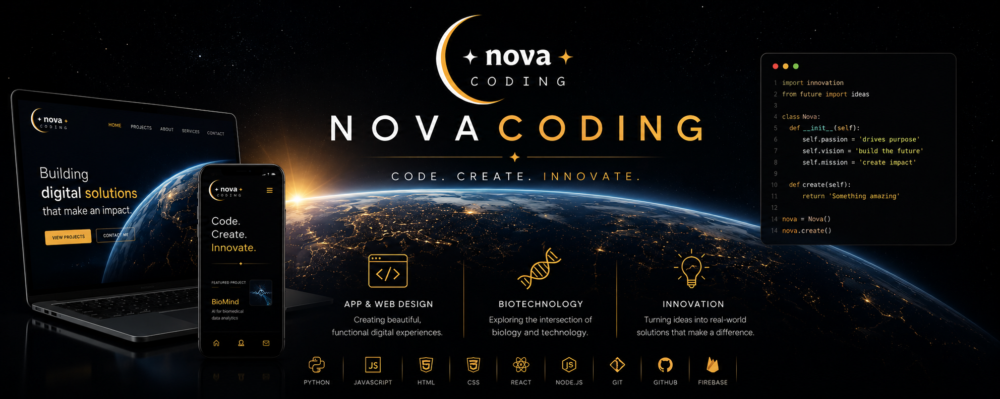

👋 Hi, I’m Gianpaolo

⸻

🚀 About Me

I’m a 18-year-old student from Italy(Apulia) passionate about building technology that solves real problems.

My main interests are:

* 📱 App & Web Design
* 🦾 Robotics
* 💻 Software Development
* 🧬 Biomedical Engineering
* 🚀 Space Technology
* 📈 Building digital products and startups

I enjoy learning by creating projects from scratch and constantly improving my skills.

⸻

🛠 Tech Stack

⸻

📌 Featured Projects

🐶 ForDoggo

A platform designed to connect dog owners with trusted pet services through community features, local discovery and modern web technologies.

🧬 ImmunoMind

Interactive immune system simulator built with Python to visualize immune responses, infections and treatments in real time.

🦠 BioMind

A real-time microbial ecosystem simulator built in Python, featuring real microorganisms, biologically inspired growth models, 
and customizable environmental conditions such as temperature, pH, and simulation speed.

⸻

🔥 Contribution Streak

⸻

🎯 Goals

* Build an own management software.
* Develop robotics projects.
* Launch successful startups.
* Contribute to open source.
* Make a lot of money🙂

⸻

🌍 Currently Learning

* Machine Learning
* Deep Learning
* C++
* Backend Development
* Embedded Systems
* Software Architecture

⸻

📫 Connect With Me

If you’re interested in Design , Robotics or innovative projects, feel free to explore my repositories!

⸻

⸻

“The best way to predict the future is to build it.”

⭐ Thanks for visiting my profile!

